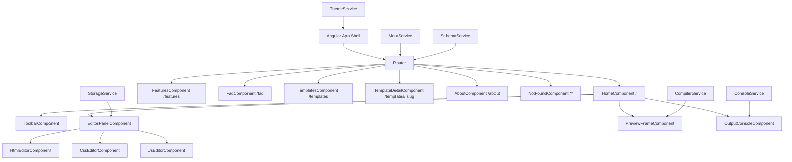

# Angular HTML Compiler — Implementation Plan

## Overview

Build a fully functional, browser-based HTML/CSS/JS compiler using **Angular 21** (already scaffolded), featuring Monaco Editor, live iframe preview, error console, starter templates, full SSR, and a complete SEO strategy for Vercel deployment.

---

## User Review Required

> [!IMPORTANT]
> **Angular Version**: Your project uses **Angular 21** (not 17+). This is the latest version and all features are fully compatible. The plan uses Angular 21 APIs throughout.

> [!IMPORTANT]
> **SSR Complexity**: Angular SSR (Universal) requires `ng add @angular/ssr`, which adds a server entry point. Monaco Editor uses `window` and `document` APIs that **crash** during SSR. All Monaco/editor code will be guarded with `isPlatformBrowser()`. This requires careful handling.

> [!WARNING]
> **Monaco Editor Bundle Size**: Monaco editor is very large (~5MB+). It will be **lazy loaded** only when the editor tab is active using dynamic imports. The angular.json asset glob must be updated to copy Monaco worker files.

> [!IMPORTANT]
> **Budget Override**: Angular's default `maximumError: 1MB` will be exceeded by Monaco. We'll increase the budget in `angular.json`.

> [!NOTE]
> **App Name**: I'll use **"CodeCanvas"** as the app brand name throughout. Let me know if you prefer a different name.

---

## Open Questions

> [!IMPORTANT]
> 1. **App Name**: Should I use "CodeCanvas" or do you have a preferred brand name?
> 2. **Google Site Verification Code**: Do you have a Google Search Console verification code? I'll add a placeholder that you can swap.
> 3. **Domain**: What's the Vercel deployment domain? (e.g., `codecanvas.vercel.app`). I'll use a placeholder.
> 4. **Styling**: The spec mentions Tailwind CSS or Angular Material. Given the premium design requirement, I'll use **Tailwind CSS v3** with custom CSS variables for theming. OK?
> 5. **State Management**: I'll use **Angular Signals** (no NgRx overhead). OK?

---

## Proposed Changes

### Phase 1 — Dependencies & Configuration

#### [MODIFY] [package.json](file:///c:/Users/sameer.kumar/Desktop/Html%20Compiler/HtmlCompailer/package.json)
Add:
- `ngx-monaco-editor-v2` + `monaco-editor`
- `angular-split` (resizable split panels)
- `@angular/ssr` (SSR/Universal)
- `@angular/animations` (required by some deps)

#### [MODIFY] [angular.json](file:///c:/Users/sameer.kumar/Desktop/Html%20Compiler/HtmlCompailer/angular.json)
- Add Monaco editor assets glob
- Increase bundle size budgets
- Add SSR builder configuration after `ng add @angular/ssr`
- Add prerender routes

---

### Phase 2 — Core Services

#### [NEW] `src/app/core/services/compiler.service.ts`
Combines HTML + CSS + JS into a full `srcdoc` document string. Injects console capture script.

#### [NEW] `src/app/core/services/console.service.ts`
Listens for `postMessage` events from the iframe. Stores logs as a signal array with type (log/warn/error).

#### [NEW] `src/app/core/services/storage.service.ts`
LocalStorage read/write with `isPlatformBrowser()` guard. Persists HTML/CSS/JS state.

#### [NEW] `src/app/core/services/meta.service.ts` (BaseMetaService)
`setMeta(title, description, keywords, canonicalUrl)` — wraps Angular's `Meta` and `Title` services.

#### [NEW] `src/app/core/services/schema.service.ts`
`injectSchema(schemaObject)` — appends `<script type="application/ld+json">` to `<head>`.

#### [NEW] `src/app/core/services/theme.service.ts`
Dark/Light theme toggle. Persists to localStorage.

#### [NEW] `src/app/shared/models/editor-state.model.ts`
TypeScript interfaces for `EditorState`, `ConsoleMessage`, `Template`.

---

### Phase 3 — Shared Components

#### [NEW] `src/app/shared/components/toolbar/toolbar.component.ts`
Top bar with: Logo, Run button, Auto-run toggle, Clear button, Template dropdown, Dark/Light toggle, Download button, Share button.

#### [NEW] `src/app/shared/components/tab-bar/tab-bar.component.ts`
Tab switcher for HTML / CSS / JS editors.

---

### Phase 4 — Feature Components

#### [NEW] `src/app/features/editor/editor-panel/editor-panel.component.ts`
Host component for the three Monaco editor tabs. Lazy-loads Monaco. Manages tab switching with signals.

#### [NEW] `src/app/features/editor/html-editor/html-editor.component.ts`
Monaco editor configured for `html` language.

#### [NEW] `src/app/features/editor/css-editor/css-editor.component.ts`
Monaco editor configured for `css` language.

#### [NEW] `src/app/features/editor/js-editor/js-editor.component.ts`
Monaco editor configured for `javascript` language.

#### [NEW] `src/app/features/preview/preview-frame/preview-frame.component.ts`
Sandboxed `<iframe>` using `srcdoc`. Receives compiled output from `CompilerService`.

#### [NEW] `src/app/features/console/output-console/output-console.component.ts`
Displays color-coded console output (green/red/yellow). Listens to `ConsoleService`.

---

### Phase 5 — Page Components (Routes)

#### [MODIFY] `src/app/app.routes.ts`
```
/ → HomeComponent (editor IDE)
/features → FeaturesComponent
/faq → FaqComponent
/templates → TemplatesComponent
/templates/:slug → TemplateDetailComponent
/about → AboutComponent
** → NotFoundComponent
```
All routes use `loadComponent` for lazy loading.

#### [NEW] `src/app/pages/home/home.component.ts`
Full IDE layout with split panels (angular-split). Contains toolbar, editor panel, preview frame, console panel. Includes SEO content block (keyword-rich static text below editor).

#### [NEW] `src/app/pages/features/features.component.ts`
Feature showcase page with cards, animations, breadcrumb.

#### [NEW] `src/app/pages/faq/faq.component.ts`
10 FAQs with accordion + FAQ JSON-LD schema injection.

#### [NEW] `src/app/pages/templates/templates.component.ts`
Grid of template cards linking to `/templates/:slug`.

#### [NEW] `src/app/pages/templates/template-detail/template-detail.component.ts`
Individual template page with editor pre-filled.

#### [NEW] `src/app/pages/about/about.component.ts`
About page with BreadcrumbList schema.

#### [NEW] `src/app/pages/not-found/not-found.component.ts`
404 page, `noindex, follow` robots meta.

---

### Phase 6 — Main App Shell

#### [MODIFY] `src/app/app.ts`
Minimal router-outlet shell.

#### [MODIFY] `src/app/app.config.ts`
Add: `provideMonacoEditor()`, `provideAnimations()`, `PreloadAllModules`, `provideClientHydration()` (SSR), router config.

#### [MODIFY] `src/index.html`
Add: Google Site Verification meta, Open Graph defaults, preload hints, Google Fonts (Inter).

#### [MODIFY] `src/styles.css`
Full design system: CSS custom properties, dark/light themes, Tailwind base utilities, global animations.

---

### Phase 7 — SSR & Deployment

#### Run `ng add @angular/ssr` (CLI command)
This generates: `src/app/app.config.server.ts`, `src/server.ts`, updates `angular.json`.

#### [NEW] `vercel.json`
SSR routing, static asset caching headers, 301 redirects.

#### [NEW] `public/robots.txt`
```
User-agent: *
Allow: /
Sitemap: https://yourdomain.com/sitemap.xml
```

#### [NEW] `public/sitemap.xml`
All routes pre-generated with priority and changefreq.

#### [NEW] `scripts/generate-sitemap.js`
Node.js script run as part of Vercel build to generate sitemap dynamically.

---

### Phase 8 — Assets & SEO Media

#### [NEW] OG Images
Generate 1200×630px Open Graph images for Home, Features, FAQ, Templates pages stored in `public/assets/og/`.

---

## Starter Templates (10 templates)

| Slug | Name |
|------|------|
| `hello-world` | Hello World |
| `flexbox-layout` | Flexbox Layout |
| `css-animation` | CSS Animation |
| `form-validation` | Form with Validation |
| `fetch-api` | Fetch API Demo |
| `css-grid` | CSS Grid Layout |
| `todo-app` | Todo App |
| `dark-mode` | Dark Mode Toggle |
| `countdown-timer` | Countdown Timer |
| `landing-page` | Landing Page |

---

## Architecture Diagram



---

## Verification Plan

### Automated Build Tests
- `npm run build` — confirm no TypeScript errors, bundle within budget
- `npm start` — confirm dev server runs correctly

### Browser Testing
- Monaco Editor loads and highlights syntax in all 3 languages
- Live preview renders HTML+CSS+JS correctly
- console.log/error/warn captured from iframe
- Auto-run debounce works (500ms)
- localStorage persists code on refresh
- All 10 templates load correctly
- All routes navigate correctly
- 404 page works

### SSR Verification
- `view-source:http://localhost:4200` shows full HTML (not empty shell)
- No `window is not defined` errors

### SEO Verification
- Each page has unique title + meta description
- `/robots.txt` and `/sitemap.xml` accessible
- JSON-LD schema validates at schema.org/validator
- Lighthouse scores: Performance >90, SEO 100, A11y >90

---

## Implementation Order

1. Install dependencies (npm install)
2. Run `ng add @angular/ssr`
3. Set up core services
4. Build shared models and components
5. Build feature components (editor, preview, console)
6. Build all page components
7. Wire up routing and app config
8. Style everything (CSS design system)
9. Add SEO (meta, schema, OG tags)
10. Configure SSR and Vercel
11. Generate assets (OG images, sitemap, robots.txt)
12. Final verification
